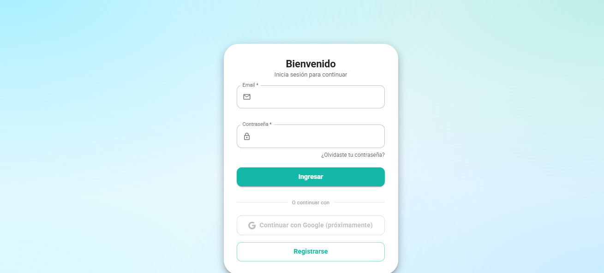
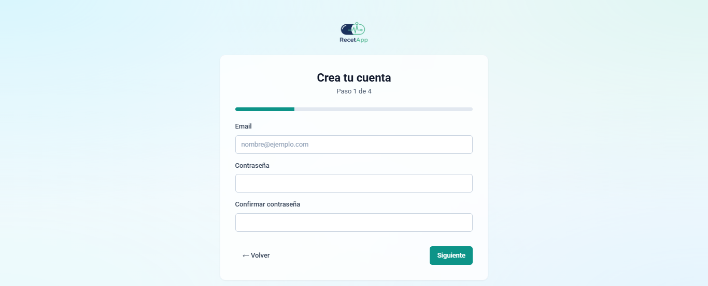
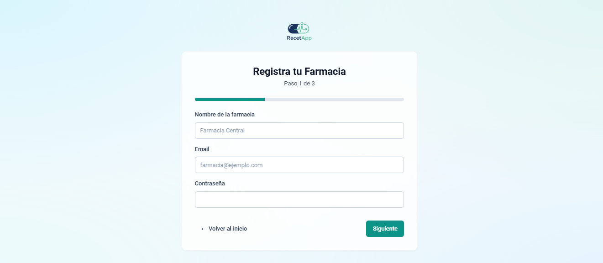
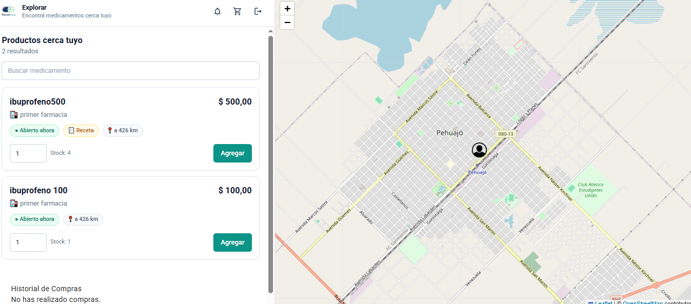

# RecetApp (G2 Innovation)

Plataforma web para **búsqueda, compra y gestión de medicamentos** con geolocalización y flujos por rol.

- **Usuario**: explora productos cercanos, agrega al carrito, sube receta (si aplica) y sigue el estado de compra.
- **Farmacia**: publica productos, gestiona ventas y revisa recetas + altas de delivery.
- **Distribuidor (Delivery)**: administra pedidos y su flujo de verificación.

> Frontend: React (CRA) + Tailwind + componentes UI. Backend: Firebase (Auth + Realtime Database + Cloud Functions).

---

## Capturas

Coloca **solo** estas imágenes en `docs/screenshots/` con los nombres exactos:

1) Inicio de sesión



2) Registro


3) Registro: selección de rol



4) Registro Usuario



5) Registro Farmacia


6) Registro Delivery


7) Inicio del Usuario (Split View)



---

## Features (por rol)

### Usuario

- **Split View**: lista de productos (scroll) + mapa fijo (Leaflet) para explorar sin perder contexto.
- **Cards** de producto con precio, badges (abierto/cerrado, receta) y distancia.
- **Carrito** con cantidades por producto y compra “por lote”.
- **Recetas médicas**: si un producto requiere receta, se habilita carga de imagen y queda en estado `pendiente` hasta revisión.
- **Notificaciones**: avisos por aceptación/rechazo de receta.
- **Historial de compras**: seguimiento de estado (`enviando`, `recibido`, etc.).

### Farmacia

- Alta y gestión de **productos** (nombre, precio, stock, receta, metadatos como CNM/fecha vencimiento, etc.).
- **Ventas en local** (descuenta stock).
- **Notificaciones** centralizadas:
  - Revisión de **recetas** (aprobar/rechazar) con notificación al usuario.
  - Revisión de **registros de delivery** (aceptar/rechazar) con notificación al delivery.
- Creación de delivery desde una sesión de farmacia (vía Cloud Function) para **no perder la sesión**.

### Distribuidor (Delivery)

- Panel operativo para ver pedidos/estado y acciones del flujo de entrega.
- Flujo de **verificación** (pendiente/aceptado/rechazado) con posibilidad de reintento.

---

## Stack técnico

### Frontend

- React `19` (Create React App)
- React Router
- Tailwind CSS
- UI: componentes internos tipo shadcn (`src/components/ui/*`) + Material UI (pantallas de login)
- Mapas: Leaflet + React-Leaflet

### Backend (Firebase)

- Firebase Authentication
- Firebase Realtime Database (modelo de datos principal)
- Firebase Cloud Functions (`functions/`) para operaciones privilegiadas (Admin SDK)

### Integración adicional

- OpenRouteService: cálculo de distancia/tiempo por ruta (requiere API Key)
- Firebase Data Connect: carpeta y configuración presentes (`dataconnect/`), actualmente no es el datastore principal del frontend.

---

## Arquitectura (alto nivel)

### Navegación

- `/` inicio de sesión
- `/register` registro con selección de rol
- `/usuario` panel Usuario
- `/farmacia` panel Farmacia
- `/notificaciones` vista Farmacia con recetas + registros delivery
- `/distribuidor` panel Delivery

### Persistencia y estado

- **Perfil por rol** en Realtime Database: `users/{uid}`
- Autenticación por Firebase Auth; el rol se resuelve leyendo `users/{uid}` y redireccionando a su panel.
- Notificaciones “push-like” via RTDB: `notificaciones/{uid}`

---

## Modelo de datos (Realtime Database)

Rutas principales utilizadas por la app:

- `users/{uid}`: perfil y rol (`Usuario` | `Farmacia` | `Distribuidor`)
- `productos/{productoId}`: catálogo publicado por farmacias
- `compras/{uid}/{compraId}`: compras por usuario
- `recetas/{recetaId}`: recetas médicas (base64) y estado (`pendiente` / `aceptada` / `rechazada`)
- `notificaciones/{uid}/{notifId}`: mensajes por eventos (recetas, registro delivery, etc.)

> Nota: el proyecto almacena algunas imágenes como **data URL (Base64)** en RTDB para simplificar el entorno académico.

---

## Requisitos

- Node.js 18+ recomendado
- NPM 9+ recomendado
- Proyecto Firebase configurado (Auth + Realtime Database + Functions)

---

## Configuración local

### 1) Instalar dependencias

```bash
npm install
```

### 2) Variables de entorno

Crea un archivo `.env` en la raíz del proyecto:

```bash
REACT_APP_FIREBASE_API_KEY=
REACT_APP_FIREBASE_AUTH_DOMAIN=
REACT_APP_FIREBASE_DATABASE_URL=
REACT_APP_FIREBASE_PROJECT_ID=
REACT_APP_FIREBASE_STORAGE_BUCKET=
REACT_APP_FIREBASE_MESSAGING_SENDER_ID=
REACT_APP_FIREBASE_APP_ID=
REACT_APP_FIREBASE_MEASUREMENT_ID=

# Opcional (distancias por ruta):
REACT_APP_OPENROUTE_API_KEY=
```

> Si `REACT_APP_OPENROUTE_API_KEY` no está configurada, la app puede seguir funcionando pero la distancia por ruta puede no calcularse.

### 3) Ejecutar la app

```bash
npm start
```

Frontend en: `http://localhost:3000`

---

## Tests y calidad

```bash
npm test -- --watchAll=false
```

Build de producción (incluye ESLint y falla si hay warnings en CI):

```bash
npm run build
```

---

## Cloud Functions

Funciones relevantes (ver `functions/index.js`):

- `deleteUserByUid`: elimina un usuario de Auth por UID (solo `Farmacia`/`Admin`).
- `farmaciaCreateDistribuidor`: crea un delivery desde sesión Farmacia y genera notificaciones.

Para instalar dependencias en functions:

```bash
cd functions
npm install
```

> El deploy depende de tu configuración de Firebase CLI y proyecto asociado.

---

## Estructura del repositorio (resumen)

- `src/components/` pantallas por rol + componentes funcionales
- `src/components/ui/` primitives UI (Button/Input/Badge/Alert/Modal/Progress)
- `src/utils/` helpers de negocio sobre RTDB
- `functions/` Cloud Functions (Admin SDK)
- `dataconnect/` configuración y esquema de Data Connect

---

## Contexto

Proyecto desarrollado en el marco de **Ingeniería de Software** (enfoque: experiencia por rol, validaciones, flujos y consistencia de datos).
